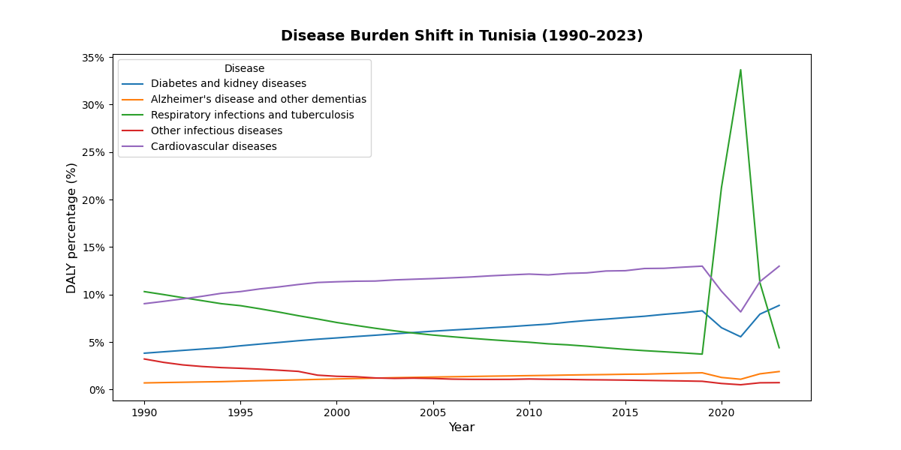
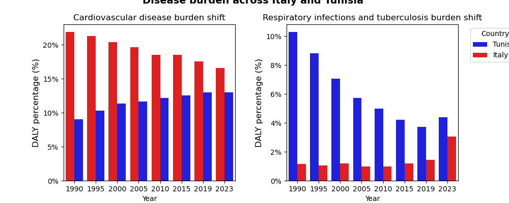
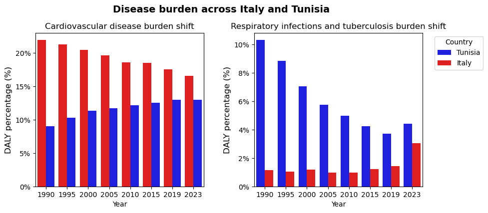

# Mediterranean GBD Disease Burden Transition

Comparative analysis of the epidemiological transition in Tunisia and its Mediterranean neighbours, based on Global Burden of Disease (GBD) data, 1990–2023.


## Research question

Is Tunisia a middle-income Mediterranean country in North Africa undergoing an epidemiological transition from infectious-disease dominance towards chronic-disease dominance?

The analysis examines Tunisia's disease burden over three decades and compares its trajectory to two reference groups:

  **Morocco and Egypt**: North African neighbours at a comparable stage of development
  **Italy**: a high-income European Mediterranean country that has already completed the transition

Comparing these trajectories makes it possible to locate each country along the transition and to form hypotheses about the drivers acting at different stages of economic development.


## Background: the metrics

**DALY (Disability-Adjusted Life Year)** is the burden metric used. One DALY equals one year of healthy life lost, and is the sum of:

  **YLL** (Years of Life Lost): premature mortality attributable to a disease
  **YLD** (Years Lived with Disability): years lived in reduced health

Because DALYs combine mortality and morbidity into a single figure, burden can be compared directly across causes and populations. All values in this analysis are expressed as a **percentage of total DALYs**, i.e. the *relative share* of the national burden attributable to each cause, not absolute counts.

Each estimate comes with an **upper and lower uncertainty bound**, which is used explicitly in the third figure.


## Data

| | |
|---|---|
| Source | Institute for Health Metrics and Evaluation (IHME), GBD Results Tool |
| Years | 1990–2023 |
| Countries | Tunisia, Morocco, Egypt, Italy |
| Sex / age | Both sexes, all ages |
| Measure | DALYs, metric: percent |
| Causes | Cardiovascular diseases; Diabetes and kidney diseases; Alzheimer's disease and other dementias; Respiratory infections and tuberculosis; Other infectious diseases |
| Shape | 680 rows × 18 columns |

The five causes were chosen to cover both sides of the transition: three chronic/non-communicable causes and two infectious ones.


## Repository structure

```
data/        GBD export (CSV) + IHME citation
figures/     generated plots (PNG)
scripts/     eda-gbd.ipynb
```


## Method

1. **Exploratory data analysis**: load the CSV and verify shape, column names, dtypes, missing values, and the exact category strings in `cause_name` and `location_name` (needed for reliable filtering).
2. **Within-country trend** : filter to Tunisia and plot all five causes over time.
3. **Cross-country comparison** : filter to cardiovascular disease and to respiratory infections separately, and plot all four countries side by side.
4. **Uncertainty check** : restrict to Tunisia and Italy at eight snapshot years (1990, 1995, 2000, 2005, 2010, 2015, 2019, 2023) and compare the estimates together with their uncertainty intervals, to test whether the observed shift survives the uncertainty in the estimates.

Built with `pandas`, `seaborn`, and `matplotlib`.


## Results

### Figure 1 — Disease burden shift in Tunisia, 1990–2023



Alzheimer's disease and other dementias stay below 3% throughout, a small and stable share of the national burden.

Respiratory infections and tuberculosis start as the largest of the five causes at roughly 11% in 1990 and decline steadily to around 4–5% by 2019. A sharp spike to approximately 33% appears around 2020 before returning to 4–5% in 2023 ,almost certainly the COVID-19 pandemic, which primarily affects the respiratory system.

Cardiovascular disease rises gradually from roughly 9% in 1990 to 13% in 2023, and diabetes and kidney diseases follow a similar upward pattern. This combination, infectious burden falling, chronic burden rising, is the signature of the epidemiological transition.

One detail worth noting: both chronic causes show a brief dip around 2020. If the pandemic raised respiratory burden, why did chronic burden not also rise? The more likely explanation is a **reporting artefact**: disruption of routine diagnosis and reporting during the pandemic rather than a real reduction in chronic disease.

### Figure 2 — Four Mediterranean countries compared



**Cardiovascular disease.** The trajectories cross. In 1990 Italy carried the higher share (roughly 23%) against 9–12% in the North African countries. Over the following three decades Italy's share declined to around 16%, consistent with its post-transition status and decades of prevention and management infrastructure. The North African countries moved in the opposite direction, rising throughout the period. The divergence fits transition theory: these countries are mid-transition, with chronic burden still climbing as populations age and urbanise and as infectious burden recedes.

**Respiratory infections and tuberculosis.** All four countries decline from 1990 to 2019 and converge. The North African countries begin far higher (roughly 9–15%) than Italy (1–2%) and fall to approximately 4–5% by 2019, clear evidence of progress through the transition. The 2020–21 spike appears in all four countries and reflects pandemic-era classification and reporting rather than a reversal of the long-term trend.

### Figure 3 — Tunisia vs Italy with uncertainty intervals



Restricting to Tunisia and Italy at eight snapshot years and showing the GBD uncertainty bounds confirms that the direction of the shift is not an artefact of estimate uncertainty: Italy's cardiovascular share falls and Tunisia's rises, while both countries' respiratory burden falls, with the gap between them narrowing.


## Interpretation

Tunisia shows the expected transition pattern over 1990–2023: infectious burden down, chronic burden up. It sits between its North African neighbours and Italy, and its trajectory points towards the profile Italy already has, but Italy's own decline in cardiovascular burden shows that the rising phase is not permanent, and that the eventual plateau depends on prevention and health-system capacity rather than on time alone.

The practical implication is that Tunisia's health system faces a **double burden** during the transition: chronic disease demand is rising while infectious disease has not disappeared, and the pandemic showed how quickly infectious burden can return.

## Limitations

* The analysis uses **relative** burden (percentage of total DALYs). A rising share can reflect either a genuine increase in chronic disease or a fall in other causes. Absolute rates would be needed to separate the two.
* Only five cause groups, so this is nowhere near the full GBD hierarchy.
* Everything here is descriptive. No trend testing, no modelling, no formal comparison between countries.
* The 2020–21 values are affected by pandemic reporting disruption and shouldn't be read as clean estimates.

## Possible next steps

* Rerun with absolute DALY rates per 100,000 alongside the percentage shares
* Add HALE (Healthy Life Expectancy) as a second outcome
* Fit trend models instead of reading trends off the plots by eye
* Widen the country set beyond these four


## Reproducing the analysis

```bash
git clone https://github.com/Sarra4299/mediterranean-gbd-transition.git
cd mediterranean-gbd-transition
pip install pandas seaborn matplotlib jupyter
jupyter notebook
```

Run the notebook in `scripts/`. Figures are written to `figures/`.


## Author

**Sarra** — M.Sc. student, Saarland University.
Independent project exploring epidemiological transition patterns in Mediterranean populations.

Data source: Institute for Health Metrics and Evaluation, Global Burden of Disease Study. Used for non-commercial academic purposes.
